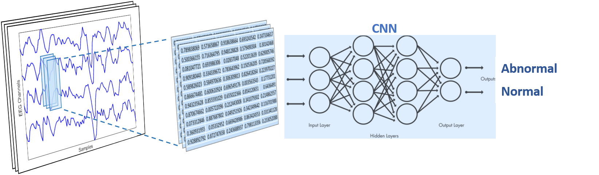

# **EEG Signal Classification Using Deep Learning**

This example shows how to build and train a convolutional neural network (CNN) from scratch to perform a binary classification task with an EEG dataset.

The EEG data used in this example were obtained from a study [1] conducted by researchers at the Temple University Hospital (TUH), and are available for download from the [TUH EEG Corpus.](https://www.isip.piconepress.com/projects/tuh_eeg/html/downloads.shtml) This example works with the TUH Abnormal EEG Corpus, which is an expert-labeled dataset suited for supervised learning.

This example seeks to train a new CNN to classify unknown EEG data as either normal or abnormal. It works through multiple steps of a deep learning workflow:

  - Exploring a public EEG dataset (stored in [EDF files](https://www.mathworks.com/help/signal/ref/edfinfo.html))
  - Preprocessing the dataset for deep learning
  - Training a CNN deep learning model to perform classification
  - Evaluating the trained model

CNNs are typically used to classify image data. Although EEG signals are not images but rather dynamic time series from electrode measurements, this example uses a deep CNN architecture that allows EEG signal input to be represented as a 2D-array.

## **Before Accessing the Data**
To register for and to access the Temple University Hospital (TUH) EEG Abnormal Corpus, go to https://www.isip.piconepress.com/projects/tuh_eeg/html/downloads.shtml#c_tueg

For convenience, the rsync command is preferred to download the corpus. It is often preinstalled on Linux and Mac platforms. Windows users can get access to rsync by installing the Windows System for Linux. 

## **Download the Data**
This dataset is relatively large. There is approximately 55 GB of data in this corpus. You can run this example meaningfully with less data, although training accuracy will be reduced.

To download the whole corpus data, use the following command:
    
	rsync -auxvL nedc@www.isip.piconepress.com:data/tuh_eeg_abnormal/v2.0.0/

To download a subset of the dataset, a script, `downloadSubset.m`, is provided.

## **Running the Example**
Open and run the live script `AbnormalEEGSignalClassificationUsingDeepLearning.mlx`. Download custom layers and additional helper functions as needed from the `extras_` folder.

Requires:
- [MATLAB](https://www.mathworks.com/products/matlab.html) (version R2021a or later)
- [Deep Learning Toolbox](https://www.mathworks.com/products/deep-learning.html)

Optional:
- [Parallel Computing Toolbox](https://www.mathworks.com/products/parallel-computing.html)

## **References**
[1] Obeid, I., & Picone, J. (2018). The Temple University Hospital EEG Data Corpus. In Augmentation of Brain Function: Facts, Fiction and Controversy. Volume I: Brain-Machine Interfaces (1st ed., pp. 394-398). Lausanne, Switzerland: Frontiers Media S.A.

Copyright 2021 The MathWorks, Inc.
